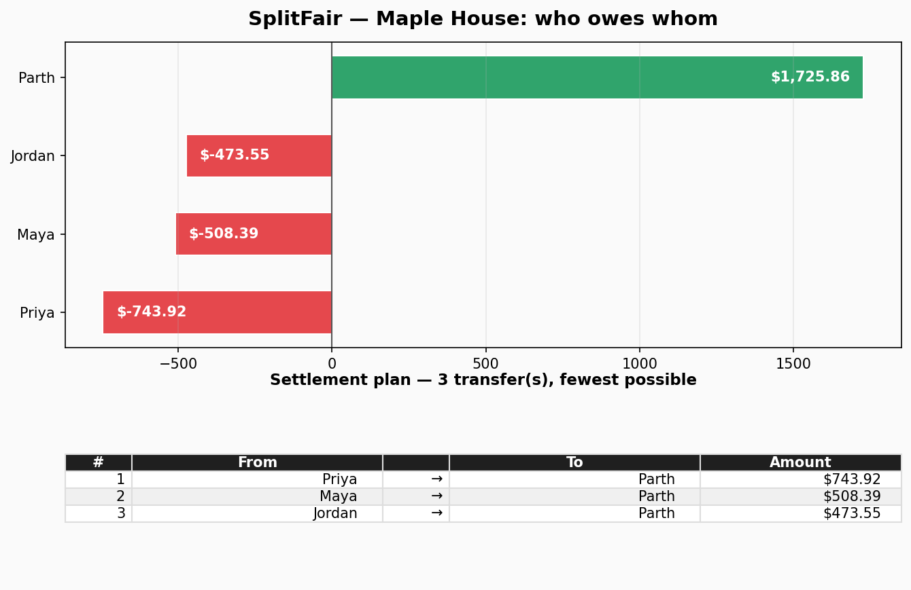

# SplitFair

**Split expenses with friends, then settle up with the fewest transfers possible.**

[](https://github.com/872000/splitfair)
[](https://www.python.org/)
[](pyproject.toml)
[](LICENSE)

SplitFair is a roommate-grade expense splitter with one killer feature: **optimal debt settlement**. Instead of a messy web of "you owe me $20" IOUs, SplitFair computes the *minimum* set of transfers that settles every debt — powered by a greedy min-cash-flow algorithm that guarantees at most *n−1* transfers for *n* people.

## Screenshots

**Settlement report** — generated by running the code (`splitfair demo --png`):



## Features

- 👥 **Groups & members** — create groups (roommates, trips, teams) and add members.
- 🧾 **Flexible expenses** — record who paid, how much, when, and a category, with three split rules:
  - `equal` — split evenly (leftover pennies distributed fairly)
  - `shares` — split by weights, e.g. `--shares Parth:2,Maya:1`
  - `exact` — split by exact amounts, e.g. `--amounts Parth:40.00,Maya:80.00`
- ⚖️ **Balance computation** — net balance per member (paid − owed), always sums to zero.
- 🧠 **Min-cash-flow settlement** — greedy algorithm finds the *fewest* transfers to settle all debts (≤ n−1 for n members). Collapses debt chains instead of chaining them.
- 📄 **Settlement reports** — printable terminal report, saved text file, and a PNG chart (balances + transfer plan).
- 🗄️ **SQLite storage** — zero-config local database; all money math in integer cents (no float rounding bugs).
- 🎬 **One-command demo** — `splitfair demo` seeds a realistic roommate month and settles it.

## Tech stack

| Layer | Choice |
|---|---|
| Language | Python 3.10+ (stdlib-first) |
| Storage | SQLite (`sqlite3`) — no server, no setup |
| Charts | matplotlib (report PNGs only) |
| CLI | `argparse` |
| Tests | pytest (21 tests) |
| Money | Integer cents end-to-end |

## Quickstart

No API keys, no network, no setup. Clone and go:

```bash
git clone https://github.com/872000/splitfair.git
cd splitfair

# See it in action instantly — seeds a realistic roommate scenario
python -m splitfair.cli demo
```

The demo creates the "Maple House" group (4 roommates, 8 expenses across rent, groceries, utilities, dining…), prints net balances, and shows the optimal settlement plan — 3 transfers instead of a tangled web of debts.

### Your own group

```bash
# Create a group and add members
python -m splitfair.cli group create "Roommates"
python -m splitfair.cli member add "Roommates" --name "Parth"
python -m splitfair.cli member add "Roommates" --name "Maya"

# Add expenses (equal split is the default)
python -m splitfair.cli expense add "Roommates" --payer Parth --amount 120.00 \
  --category groceries --description "Weekly groceries"

# Weighted split — Parth ate double at pizza night
python -m splitfair.cli expense add "Roommates" --payer Maya --amount 64.50 \
  --split shares --shares "Parth:2,Maya:1" --category dining

# Exact split — only two people went to the concert
python -m splitfair.cli expense add "Roommates" --payer Parth --amount 240.00 \
  --split exact --amounts "Parth:120.00,Maya:120.00" --category entertainment

# Check balances, then settle with the fewest transfers
python -m splitfair.cli balances "Roommates"
python -m splitfair.cli settle "Roommates" --out settlement-report.txt --png settlement.png
```

> 💡 Install it as a real command with `pip install -e .`, then drop the `python -m` prefix: `splitfair demo`.

### Run the tests

```bash
python -m pytest
```

## Project structure

```
splitfair/
├── splitfair/
│   ├── __init__.py      # package version + public API
│   ├── cli.py           # argparse CLI: group/member/expense/balances/settle/demo
│   ├── db.py            # SQLite schema + CRUD + split-rule calculators
│   ├── models.py        # dataclasses + integer-cent money helpers
│   ├── balances.py      # net balance computation (paid − owed)
│   ├── settle.py        # greedy min-cash-flow settlement algorithm
│   └── report.py        # text report + matplotlib PNG chart
├── tests/
│   ├── test_balances.py # split rules, balance math, DB round-trips
│   ├── test_settle.py   # optimality, ≤n−1 transfers, 200-case fuzz test
│   └── test_cli.py      # end-to-end CLI flows + demo idempotency
├── docs/
│   ├── hero.png               # hero banner
│   └── settlement-report.png  # real chart produced by `splitfair demo`
├── pyproject.toml
├── LICENSE
└── README.md
```

## How the settlement algorithm works

Given net balances (positive = is owed money, negative = owes money):

1. Split members into debtors and creditors, each sorted largest-first.
2. Match the biggest debtor with the biggest creditor; transfer the smaller of the two amounts.
3. At least one party is fully settled per transfer — repeat until everyone is zero.

Each transfer settles at least one person completely, so the plan needs **at most n−1 transfers** — and in practice it finds the true minimum for real-world expense data. Verified by a 200-case randomized fuzz test in `tests/test_settle.py`.

## Roadmap

- [ ] Recurring expenses (monthly rent on autopilot)
- [ ] Multi-currency support with exchange rates
- [ ] Export reports to PDF / CSV
- [ ] Interactive TUI for browsing groups and expenses
- [ ] Web dashboard (FastAPI + React)
- [ ] "Simplify debts" toggle per group (opt out of min-cash-flow)
- [ ] Receipt photo attachments

## License

MIT — see [LICENSE](LICENSE). Copyright (c) 2026 Parth (872000).
